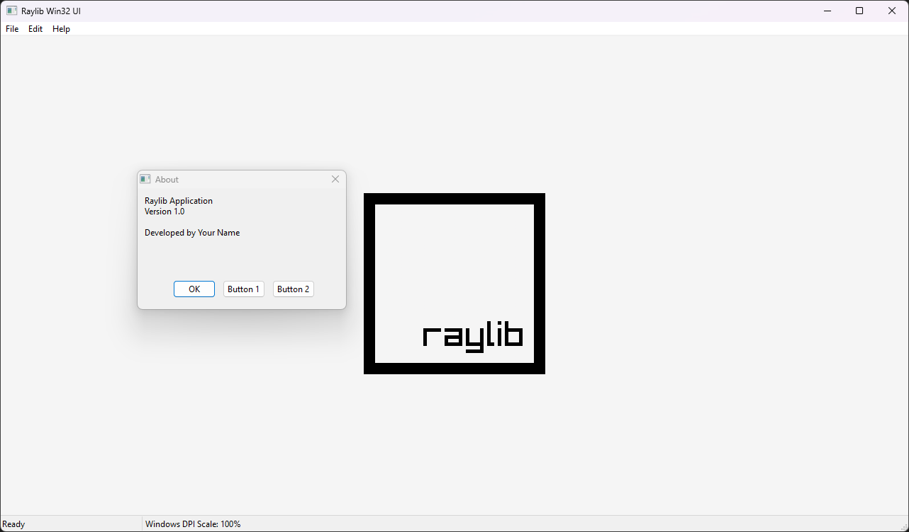

# Raylib Win32 Controls Integration

A quick example on how to use Win32 controls in your raylib application.  

For this to work we need to store the original raylib window callback. This handles all input and updates for the window
````c++
LONG_PTR originalWndProc = GetWindowLongPtr(hwnd, GWLP_WNDPROC); // Get the original callback from Raylib
SetWindowLongPtr(hwnd, GWLP_USERDATA, originalWndProc); // Store the original callback from Raylib
````
After we have it stored in *GWLP_USERDATA* we can now use it with:
````c++
return CallWindowProc((WNDPROC)GetWindowLongPtr(hwnd, GWLP_USERDATA), hwnd, uMsg, wParam, lParam);
````
Now we can use Win32 controls pretty easily in your raylib application
## How to build

This project uses CMake, so make sure you have CMake installed!

### Configure CMake project
```bash
mkdir build
cd build
cmake ../
````

### Debug Build 
````bash
cmake --build . --config Debug
````

### Release Build 
````bash
cmake --build . --config Release
````


## Screenshots


